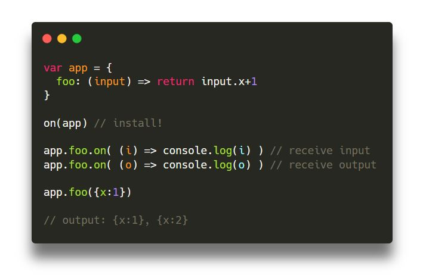
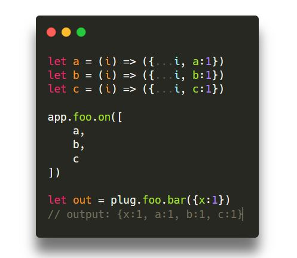
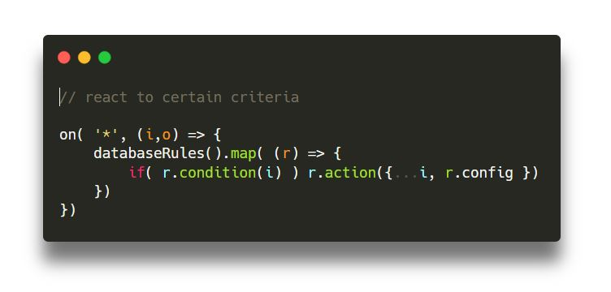

<center>
	
</center>

SUPERON is a tiny functional bus (nodejs+browser) which separates mechanisms vs policy:

<center>
	
</center>

* **fast**: BAM!
* **tiny**: only 917 bytes (gzipped)
* **simple**: your functions **are** the events, so byebye (missing) eventemitter-strings
* **business rule engine**: add your own expression language and save/load rules from db

## pied piper

<center> 
	
</center>

## bizniz rools!

<center> 
	
</center>

## good-enough immutable

```
app.foo.fork = (i) => i 

app.foo.on( (i) => app.foo.fork( i.clone() ) )
```

## immersive-cli-driven development with SUPERON 

* SUPERON is **service-agnostic**: turn on/off multi-services (http/mqtt/irc/etc) using superon
* **end-user friendly**: pass enduser-expression languages like [filtrex](https://npmjs.com/filtrex) or [json-logic-js](https://npmjs.com/json-logic-js) to `.when()`
* **database friendly**: save/load enduser-rules using `.load()` and `.serialize()`
* **plugins**: functions as plugins
* **isomorphic cli**: control/modify policies using `curl`, browser
* **immersive cli**: easily extendable with [vorpal](https://npmjs.com/vorpal), [inquirer](https://npmjs.com/inquirer), [enquirer](https://npmjs.com/enquirer)


## Philosophy

* Unix rule policy vs mechanism
* Unix rule of transparency 

## Easy-peasy plugins

// todo
